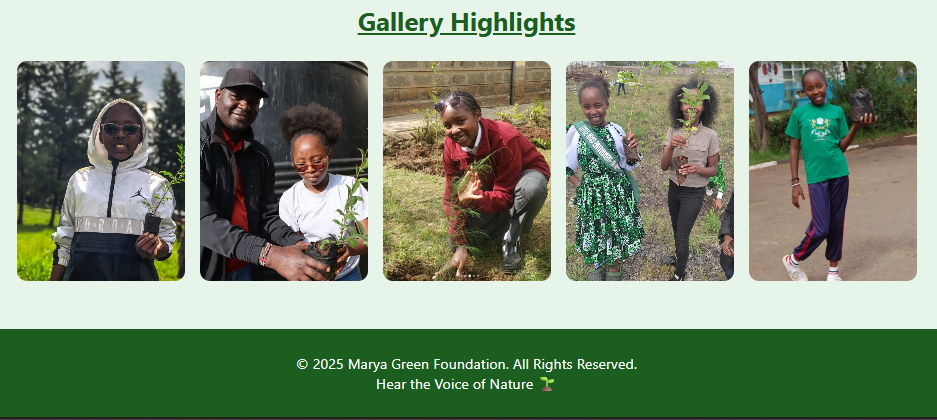

# 🌱 Marya Green Foundation

**Hear the Voice of Nature**

The **Marya Green Foundation** is a youth-led environmental initiative founded by myself, **Marya Chepkorir**, a passionate 14-year-old climate champion. I created this website to highlight my projects, environmental campaigns, and efforts to empower other young girls like me to promote climate action.

---

## 🌍 Website Overview

This static website includes four responsive pages:

- **Home** – My introduction, profile, and image gallery.  
- **Blog** – Articles and highlights of my recent activities.  
- **Projects** – Showcasing environmental and empowerment projects.  
- **Contact** – Connect with me (Marya) via email or Instagram.

## 🧭 Features

- Responsive navigation menu with hamburger toggle  
- Hero section featuring my profile & image gallery  
- Dedicated pages for Home, Blog, Projects, and Contact  
- Clean 2-column project grid layout (responsive for mobile)  
- Minimalist design using pure HTML, CSS, and JavaScript  

---

## 🧭 Navigation

| Page | Description |
|------|--------------|
| **Home** | Overview and introduction |
| **Blog** | Updates and environmental stories |
| **Projects** | Ongoing and completed initiatives |
| **Contact** | Reach out to Marya Green Foundation |

---
## 🌍 Live Demo
> [https://marya254ke.github.io/marya-green-foundation](https://marya254ke.github.io/marya-green-foundation/)

---
## 🌿 Website Homepage Screenshots

### Homepage Preview

### Gallery Section

